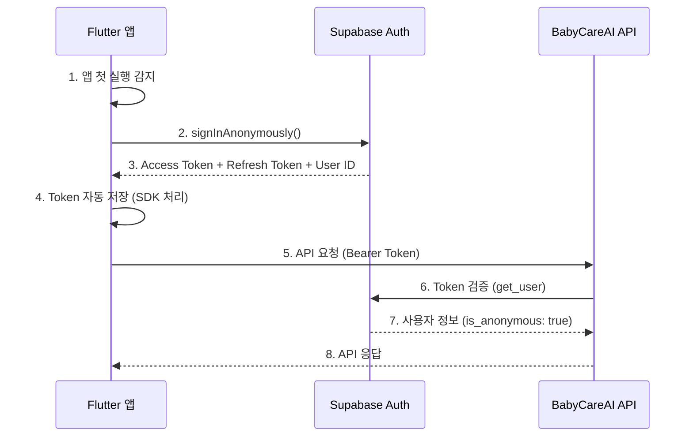
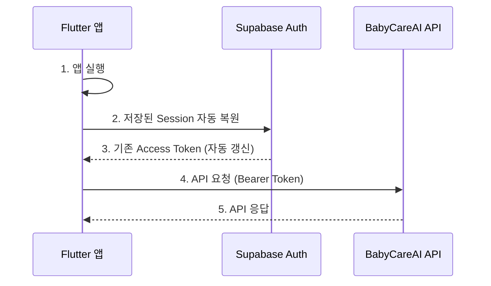
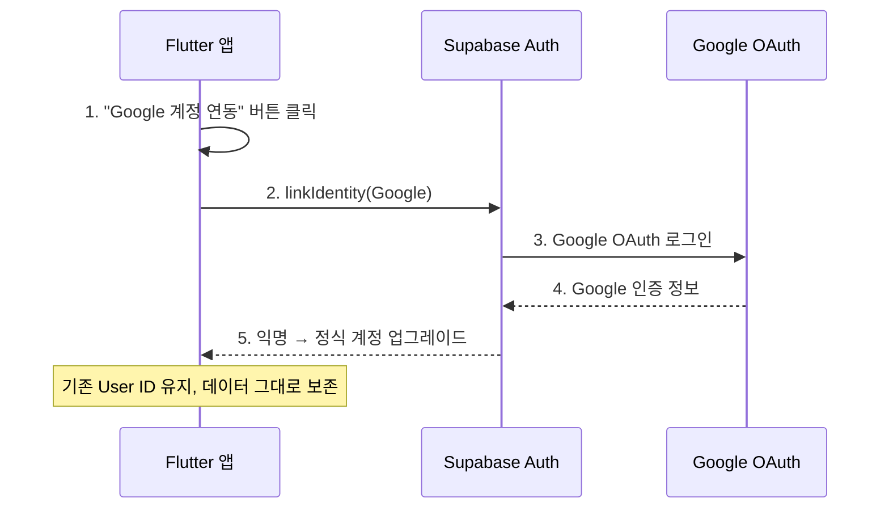

# 인증 및 사용자 관리 API 문서

## 개요

BabyCareAI는 **Supabase Anonymous Authentication**을 사용하여 기기 기반 인증을 처리합니다.
사용자는 이메일, 비밀번호, 소셜 로그인 없이 앱을 설치하고 바로 사용할 수 있습니다.

- **기기 기반 인증**: 앱 첫 실행 시 Supabase 익명 사용자 자동 생성
- **토큰 검증**: 서버에서 Supabase Access Token 검증
- **향후 계획**: Google 계정 연동 (익명 → 정식 계정 업그레이드)

---

## 📋 목차

1. [인증 방식 비교](#인증-방식-비교)
2. [인증 흐름](#인증-흐름)
3. [Supabase 익명 인증 설정](#supabase-익명-인증-설정)
4. [Flutter 구현](#flutter-구현)
5. [서버 API](#서버-api)
6. [향후: Google 계정 연동](#향후-google-계정-연동)
7. [에러 처리](#에러-처리)
8. [보안 고려사항](#보안-고려사항)
9. [FAQ](#faq)

---

## 인증 방식 비교

### 왜 익명 인증인가?

| 항목 | 이메일/비밀번호 | 소셜 로그인 | 익명 인증 (현재) |
|------|---------------|-----------|----------------|
| 사용자 진입 장벽 | 높음 | 중간 | 없음 |
| 회원가입 필요 | O | O | X |
| 앱 설치 후 즉시 사용 | X | X | O |
| 기기 변경 시 데이터 이전 | 가능 | 가능 | 계정 연동 후 가능 |
| 구현 복잡도 | 중간 | 높음 | 낮음 |

### BabyCareAI 인증 로드맵

```
Phase 1 (현재): 익명 인증 → 앱 설치 즉시 사용 가능
Phase 2 (향후): Google 계정 연동 → 기기 변경 시 데이터 이전 지원
```

---

## 인증 흐름

### 첫 실행 (익명 사용자 생성)



### 재실행 (기존 세션 복원)



### 핵심 포인트

- 사용자는 아무것도 입력하지 않아도 됨
- 앱 설치 → 실행 → 바로 사용 가능
- Supabase가 고유한 User ID (UUID) 자동 부여
- 같은 기기에서 앱을 재실행하면 기존 세션이 자동 복원됨
- Token은 Supabase SDK가 자동으로 저장/갱신 관리

---

## Supabase 익명 인증 설정

### Supabase Dashboard 설정

익명 인증을 사용하려면 Supabase Dashboard에서 활성화해야 합니다.

1. [Supabase Dashboard](https://supabase.com/dashboard) 접속
2. 프로젝트 선택
3. **Authentication** > **Providers** 이동
4. **Anonymous Sign-ins** 항목을 **Enabled**로 변경
5. 저장

### 서버 측 토큰 검증

서버의 `verify_user` 함수는 익명 사용자 토큰도 동일하게 검증합니다.
**서버 코드 변경은 필요 없습니다.**

```python
# app/core/auth/service.py (변경 없음)
async def verify_user(credentials):
    token = credentials.credentials
    supabase = create_client(settings.SUPABASE_URL, settings.SUPABASE_KEY)

    # 익명 사용자 토큰도 동일하게 검증됨
    user_response = supabase.auth.get_user(token)
    user = user_response.user  # user.is_anonymous == True

    return user
```

- `user.id`: 고유 UUID (익명 사용자도 동일하게 부여)
- `user.is_anonymous`: `True` (익명 사용자 식별용)
- 익명 사용자의 `user_id`는 일반 사용자와 동일하게 DB에서 사용 가능

---

## Flutter 구현

### 1. 패키지 설치

**pubspec.yaml**:
```yaml
dependencies:
  supabase_flutter: ^2.5.0
  firebase_messaging: ^15.0.0  # 푸시 알림용 (선택)
```

### 2. Supabase 초기화

```dart
// lib/main.dart
import 'package:flutter/material.dart';
import 'package:supabase_flutter/supabase_flutter.dart';

Future<void> main() async {
  WidgetsFlutterBinding.ensureInitialized();

  await Supabase.initialize(
    url: 'https://sqztapzlinoyckxthyse.supabase.co',
    anonKey: 'your-anon-key',  // Supabase Dashboard > Settings > API에서 확인
  );

  runApp(const MyApp());
}

// 전역 Supabase 클라이언트 접근
final supabase = Supabase.instance.client;
```

### 3. AuthService 구현

```dart
// lib/services/auth_service.dart

import 'package:supabase_flutter/supabase_flutter.dart';

class AuthService {
  final SupabaseClient _supabase = Supabase.instance.client;

  /// 현재 사용자
  User? get currentUser => _supabase.auth.currentUser;

  /// 현재 세션
  Session? get currentSession => _supabase.auth.currentSession;

  /// Access Token
  String? get accessToken => currentSession?.accessToken;

  /// 로그인 상태 스트림
  Stream<AuthState> get authStateChanges => _supabase.auth.onAuthStateChange;

  /// 익명 사용자인지 확인
  bool get isAnonymous => currentUser?.isAnonymous ?? true;

  /// 인증 초기화
  /// 앱 시작 시 호출. 기존 세션이 없으면 익명 로그인 수행.
  Future<void> initialize() async {
    final session = _supabase.auth.currentSession;

    if (session != null) {
      // 기존 세션 존재 → 자동 복원됨
      return;
    }

    // 세션 없음 → 익명 로그인
    await _signInAnonymously();
  }

  /// 익명 로그인 (내부용)
  Future<AuthResponse> _signInAnonymously() async {
    try {
      final response = await _supabase.auth.signInAnonymously();

      if (response.user == null) {
        throw Exception('익명 로그인에 실패했습니다.');
      }

      return response;
    } on AuthException catch (e) {
      throw '인증에 실패했습니다: ${e.message}';
    }
  }

  /// 로그아웃 (앱 데이터 초기화 시 사용)
  Future<void> signOut() async {
    await _supabase.auth.signOut();
  }
}
```

### 4. API 클라이언트

```dart
// lib/services/api_client.dart

import 'package:dio/dio.dart';
import 'package:supabase_flutter/supabase_flutter.dart';

class ApiClient {
  late final Dio _dio;

  ApiClient() {
    _dio = Dio(BaseOptions(
      baseUrl: 'https://fromnowon-server-production.up.railway.app/api/v1',
      connectTimeout: const Duration(seconds: 10),
      receiveTimeout: const Duration(seconds: 30),
      headers: {
        'Content-Type': 'application/json',
      },
    ));

    // 인증 인터셉터
    _dio.interceptors.add(_AuthInterceptor());
  }

  Dio get dio => _dio;
}

class _AuthInterceptor extends Interceptor {
  @override
  Future<void> onRequest(
    RequestOptions options,
    RequestInterceptorHandler handler,
  ) async {
    // Supabase 세션에서 Access Token 가져오기
    final session = Supabase.instance.client.auth.currentSession;

    if (session != null) {
      options.headers['Authorization'] = 'Bearer ${session.accessToken}';
    }

    handler.next(options);
  }

  @override
  void onError(DioException err, ErrorInterceptorHandler handler) {
    if (err.response?.statusCode == 401) {
      _handleUnauthorized(err, handler);
    } else {
      handler.next(err);
    }
  }

  Future<void> _handleUnauthorized(
    DioException err,
    ErrorInterceptorHandler handler,
  ) async {
    try {
      // Token 갱신 시도
      final response =
          await Supabase.instance.client.auth.refreshSession();

      if (response.session == null) {
        // 세션 복구 불가 → 익명 재로그인
        await Supabase.instance.client.auth.signInAnonymously();
        final newSession = Supabase.instance.client.auth.currentSession;

        if (newSession == null) {
          handler.next(err);
          return;
        }
      }

      // 갱신된 Token으로 원래 요청 재시도
      final session = Supabase.instance.client.auth.currentSession;
      final options = err.requestOptions;
      options.headers['Authorization'] = 'Bearer ${session!.accessToken}';

      final retryResponse = await Dio().fetch(options);
      handler.resolve(retryResponse);
    } catch (e) {
      handler.next(err);
    }
  }
}
```

### 5. 앱 초기화 및 인증 상태 관리

```dart
// lib/main.dart

import 'package:flutter/material.dart';
import 'package:supabase_flutter/supabase_flutter.dart';

Future<void> main() async {
  WidgetsFlutterBinding.ensureInitialized();

  await Supabase.initialize(
    url: 'https://sqztapzlinoyckxthyse.supabase.co',
    anonKey: 'your-anon-key',
  );

  // 인증 초기화 (기존 세션 복원 또는 익명 로그인)
  final authService = AuthService();
  await authService.initialize();

  runApp(const MyApp());
}

class MyApp extends StatelessWidget {
  const MyApp({super.key});

  @override
  Widget build(BuildContext context) {
    return MaterialApp(
      title: 'BabyCareAI',
      home: const HomeScreen(),  // 인증 완료 → 바로 홈 화면
    );
  }
}
```

### 6. 디바이스 등록 (푸시 알림용)

```dart
// lib/services/device_service.dart

import 'dart:io';
import 'package:firebase_messaging/firebase_messaging.dart';

class DeviceService {
  final ApiClient _apiClient;

  DeviceService(this._apiClient);

  /// 디바이스 등록
  /// 앱 시작 후 인증 완료 시 호출
  Future<void> registerDevice() async {
    try {
      final fcmToken = await FirebaseMessaging.instance.getToken();
      if (fcmToken == null) return;

      await _apiClient.dio.post('/users/devices', data: {
        'device_token': fcmToken,
        'platform': Platform.isIOS ? 'ios' : 'android',
        'app_id': 'com.fromnowon.babycare',
      });
    } catch (e) {
      // 디바이스 등록 실패는 앱 사용에 영향 없음
      print('Device registration failed: $e');
    }
  }

  /// 로그인 이력 기록
  Future<void> recordLogin() async {
    try {
      final fcmToken = await FirebaseMessaging.instance.getToken();
      if (fcmToken == null) return;

      await _apiClient.dio.post('/users/login', data: {
        'device_token': fcmToken,
        'app_id': 'com.fromnowon.babycare',
      });
    } catch (e) {
      print('Login recording failed: $e');
    }
  }
}
```

### 7. 전체 앱 초기화 플로우

```dart
// lib/app_initializer.dart

class AppInitializer {
  final AuthService _authService;
  final DeviceService _deviceService;

  AppInitializer(this._authService, this._deviceService);

  /// 앱 초기화 전체 플로우
  Future<void> initialize() async {
    // Step 1: 인증 (기존 세션 복원 또는 익명 로그인)
    await _authService.initialize();

    // Step 2: 디바이스 등록 (푸시 알림용, 선택)
    await _deviceService.registerDevice();

    // Step 3: 로그인 이력 기록
    await _deviceService.recordLogin();
  }
}
```

**사용자 경험 요약**:
```
앱 설치 → 앱 실행 → (자동 인증) → 홈 화면 → 바로 사용
```

---

## 서버 API

### 인증

모든 API 요청에 Supabase Access Token이 필요합니다.

```http
Authorization: Bearer <supabase_access_token>
```

Supabase SDK가 자동으로 Token을 관리하므로, Flutter에서는 `_AuthInterceptor`가 자동으로 헤더에 추가합니다.

---

### 1. 디바이스 등록

```http
POST /api/v1/users/devices
Authorization: Bearer <supabase_access_token>
Content-Type: application/json
```

**Request Body**:
```json
{
  "device_token": "fcm_token_string",
  "platform": "ios",
  "app_id": "com.fromnowon.babycare"
}
```

| 필드 | 타입 | 필수 | 설명 |
|------|------|------|------|
| `device_token` | string | O | FCM/APNS 토큰 |
| `platform` | string | O | `"ios"` 또는 `"android"` |
| `app_id` | string | O | 앱 번들 ID |

**Response 200**:
```json
{
  "id": 1,
  "user_id": "a1b2c3d4-e5f6-7890-abcd-ef1234567890",
  "device_token": "fcm_token_string",
  "platform": "ios",
  "app_id": "com.fromnowon.babycare",
  "is_active": true,
  "created_at": "2025-01-20T10:00:00Z"
}
```

**동작**:
- 같은 `device_token`이 이미 등록되어 있으면 → 업데이트
- 신규 `device_token`이면 → 새로 등록

---

### 2. 로그인 이력 기록

```http
POST /api/v1/users/login
Authorization: Bearer <supabase_access_token>
Content-Type: application/json
```

**Request Body**:
```json
{
  "device_token": "fcm_token_string",
  "app_id": "com.fromnowon.babycare"
}
```

| 필드 | 타입 | 필수 | 설명 |
|------|------|------|------|
| `device_token` | string | O | FCM/APNS 토큰 |
| `app_id` | string | O | 앱 ID |

**Response 200**:
```json
{
  "message": "Login recorded successfully",
  "id": 123
}
```

**자동 수집 정보**: IP 주소, User-Agent

---

### 3. 사용자 디바이스 목록 조회

```http
GET /api/v1/users/{user_id}/devices
Authorization: Bearer <supabase_access_token>
```

| 파라미터 | 위치 | 타입 | 설명 |
|---------|------|------|------|
| `user_id` | path | string | 사용자 ID (UUID) |

**Response 200**:
```json
[
  {
    "id": 1,
    "user_id": "a1b2c3d4-e5f6-7890-abcd-ef1234567890",
    "device_token": "fcm_token_1",
    "platform": "ios",
    "app_id": "com.fromnowon.babycare",
    "is_active": true,
    "created_at": "2025-01-20T10:00:00Z"
  }
]
```

**Response 403**: 자신의 디바이스만 조회 가능
```json
{
  "detail": "Forbidden: You can only view your own devices"
}
```

---

## 향후: Google 계정 연동

### 개요

Phase 2에서 익명 사용자를 Google 계정으로 업그레이드할 수 있습니다.
이를 통해 기기 변경 시 데이터 이전이 가능해집니다.

### 업그레이드 흐름



### Flutter 구현 (향후)

```dart
class AuthService {
  /// 익명 계정을 Google 계정으로 업그레이드
  /// 기존 User ID와 모든 데이터가 그대로 유지됨
  Future<void> linkGoogleAccount() async {
    try {
      await _supabase.auth.linkIdentity(
        OAuthProvider.google,
        redirectTo: 'com.fromnowon.babycare://login-callback',
      );
    } on AuthException catch (e) {
      throw 'Google 계정 연동에 실패했습니다: ${e.message}';
    }
  }

  /// 다른 기기에서 Google 계정으로 로그인 (데이터 복원)
  Future<bool> signInWithGoogle() async {
    try {
      return await _supabase.auth.signInWithOAuth(
        OAuthProvider.google,
        redirectTo: 'com.fromnowon.babycare://login-callback',
      );
    } on AuthException catch (e) {
      throw 'Google 로그인에 실패했습니다: ${e.message}';
    }
  }
}
```

### 계정 연동 설정 화면 (향후)

```dart
class AccountSettingsScreen extends StatelessWidget {
  @override
  Widget build(BuildContext context) {
    final authService = context.read<AuthService>();

    return Scaffold(
      appBar: AppBar(title: const Text('계정 설정')),
      body: ListView(
        padding: const EdgeInsets.all(16),
        children: [
          // 현재 계정 상태
          ListTile(
            title: const Text('계정 상태'),
            subtitle: Text(
              authService.isAnonymous ? '게스트 (기기 기반)' : 'Google 연동 완료',
            ),
            leading: Icon(
              authService.isAnonymous ? Icons.person_outline : Icons.verified,
            ),
          ),

          // Google 연동 버튼 (익명 사용자만 표시)
          if (authService.isAnonymous) ...[
            const SizedBox(height: 16),
            const Text(
              'Google 계정을 연동하면 기기 변경 시에도\n데이터를 유지할 수 있습니다.',
              style: TextStyle(color: Colors.grey),
            ),
            const SizedBox(height: 8),
            ElevatedButton.icon(
              onPressed: () => authService.linkGoogleAccount(),
              icon: const Icon(Icons.link),
              label: const Text('Google 계정 연동'),
            ),
          ],
        ],
      ),
    );
  }
}
```

---

## 에러 처리

### 인증 관련 에러

| 상황 | 에러 | 처리 방법 |
|------|------|---------|
| 익명 로그인 실패 | `AuthException` | 재시도 (네트워크 문제일 가능성) |
| Token 만료 | HTTP 401 | SDK가 자동 갱신 / 인터셉터가 재시도 |
| Session 완전 만료 | Refresh Token 만료 | 익명 재로그인 (새 사용자 생성) |
| Supabase 서버 오류 | HTTP 500 | 재시도 후 사용자에게 안내 |

### Flutter 에러 처리

```dart
class AuthService {
  /// 안전한 인증 초기화 (에러 복구 포함)
  Future<void> initialize() async {
    try {
      final session = _supabase.auth.currentSession;

      if (session != null) {
        // 기존 세션 존재
        return;
      }

      // 익명 로그인
      await _signInAnonymously();
    } catch (e) {
      // 네트워크 오류 등으로 실패 시 재시도
      await Future.delayed(const Duration(seconds: 2));
      try {
        await _signInAnonymously();
      } catch (retryError) {
        // 2차 시도도 실패 → 오프라인 모드 또는 에러 화면
        throw '서버에 연결할 수 없습니다. 네트워크를 확인해주세요.';
      }
    }
  }
}
```

### 서버 API 에러

| 상태 코드 | 의미 | 설명 |
|---------|------|------|
| 401 | Unauthorized | Token이 없거나 유효하지 않음 |
| 403 | Forbidden | 다른 사용자의 리소스 접근 시도 |
| 500 | Internal Server Error | 서버 내부 오류 |

---

## 보안 고려사항

### 1. Token 저장

Supabase Flutter SDK는 내부적으로 안전한 저장소를 사용합니다.
별도의 Token 저장 로직이 필요 없습니다.

```dart
// Supabase SDK가 자동으로 안전하게 저장
// iOS: Keychain
// Android: EncryptedSharedPreferences

// Token 접근이 필요할 때:
final token = Supabase.instance.client.auth.currentSession?.accessToken;
```

### 2. Token 자동 갱신

| Token 종류 | 유효기간 | 갱신 방법 |
|-----------|---------|---------|
| Access Token | 1시간 | Supabase SDK가 자동 갱신 |
| Refresh Token | 30일 | Access Token 갱신 시 함께 갱신 |

### 3. 익명 사용자 데이터 보호

```sql
-- RLS (Row Level Security) 정책
-- 익명 사용자도 자신의 데이터만 접근 가능

ALTER TABLE babies ENABLE ROW LEVEL SECURITY;

CREATE POLICY "Users can manage their own babies"
ON babies FOR ALL
USING (auth.uid() = user_id)
WITH CHECK (auth.uid() = user_id);
```

### 4. 앱 삭제 시 동작

| 상황 | 결과 |
|------|------|
| 앱 삭제 후 재설치 | 새 익명 사용자 생성 (이전 데이터 접근 불가) |
| 앱 삭제 전 Google 연동 | 재설치 후 Google 로그인으로 데이터 복원 가능 |

이것이 향후 Google 계정 연동을 제공하는 이유입니다.

---

## FAQ

### Q1. 사용자가 아무것도 입력하지 않아도 되나요?
**A**: 네. 앱을 설치하고 실행하면 자동으로 익명 사용자가 생성됩니다.
Supabase가 고유한 User ID (UUID)를 부여하며, 이 ID로 데이터가 관리됩니다.

### Q2. Access Token은 얼마나 유효한가요?
**A**: 1시간입니다. Supabase SDK가 Refresh Token으로 자동 갱신하므로 앱에서 별도 처리가 필요 없습니다.

### Q3. 앱을 삭제하면 데이터가 사라지나요?
**A**: 앱 삭제 시 로컬 세션이 삭제되어 이전 익명 계정에 접근할 수 없게 됩니다.
서버의 데이터는 남아있지만 접근할 방법이 없습니다.
이를 방지하려면 Google 계정 연동(Phase 2)을 사용해야 합니다.

### Q4. 여러 기기에서 같은 데이터를 볼 수 있나요?
**A**: 현재(Phase 1)는 불가능합니다. 각 기기마다 별도의 익명 사용자가 생성됩니다.
Phase 2에서 Google 계정 연동 후 다른 기기에서 같은 Google 계정으로 로그인하면 데이터 공유가 가능합니다.

### Q5. 서버 코드를 변경해야 하나요?
**A**: 아니요. 현재 서버의 `verify_user` 함수는 `supabase.auth.get_user(token)`을 사용하며, 이 함수는 익명 사용자 토큰도 정상적으로 검증합니다. 서버 코드 변경은 불필요합니다.

### Q6. 익명 사용자와 정식 사용자의 권한 차이가 있나요?
**A**: 현재는 없습니다. 모든 API에 동일하게 접근 가능합니다.
향후 프리미엄 기능을 추가할 경우, `user.is_anonymous` 필드로 구분할 수 있습니다.

---

## 참고 자료

- [Supabase Anonymous Sign-ins](https://supabase.com/docs/guides/auth/auth-anonymous)
- [Supabase Flutter SDK](https://supabase.com/docs/reference/dart/introduction)
- [Supabase Link Identity](https://supabase.com/docs/guides/auth/auth-identity-linking)
- [API Reference](api-reference.md) - 전체 API 문서
- [Flutter Integration Guide](flutter-integration-guide.md) - Flutter 통합 가이드

---

## 요약

| 항목 | 내용 |
|------|------|
| 인증 방식 | Supabase Anonymous Auth (기기 기반) |
| 사용자 입력 | 없음 (앱 실행 시 자동) |
| Token 관리 | Supabase SDK 자동 처리 |
| 서버 변경 | 불필요 |
| 데이터 보호 | RLS (Row Level Security) |
| 향후 계획 | Google 계정 연동 (데이터 이전 지원) |
