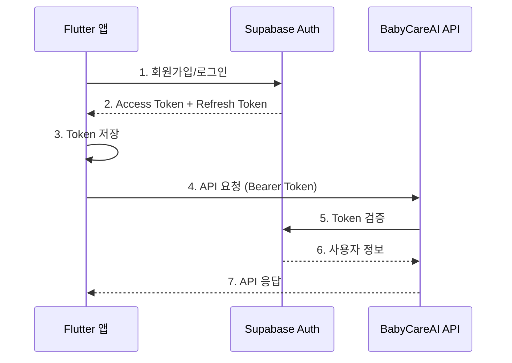

# 인증 및 사용자 관리 API 문서

## 개요

BabyCareAI API는 **Supabase Authentication**을 사용하여 사용자 인증을 처리합니다.

- **회원가입 및 로그인**: Supabase 클라이언트 SDK를 통해 처리
- **토큰 검증**: 서버에서 Supabase Access Token을 검증
- **사용자 관리**: 서버 API를 통해 디바이스 및 로그인 이력 관리

---

## 📋 목차

1. [인증 흐름](#인증-흐름)
2. [Supabase 클라이언트 SDK (회원가입/로그인)](#supabase-클라이언트-sdk)
3. [서버 API (디바이스 관리)](#서버-api)
4. [Flutter 통합 예시](#flutter-통합-예시)
5. [에러 처리](#에러-처리)

---

## 인증 흐름

### 전체 인증 프로세스



### 단계별 설명

1. **회원가입/로그인** (클라이언트)
   - Supabase 클라이언트 SDK 사용
   - 이메일/비밀번호, OAuth (Google, Apple 등)

2. **Token 발급** (Supabase)
   - Access Token: API 요청용 (유효기간: 1시간)
   - Refresh Token: Access Token 갱신용 (유효기간: 30일)
   - JWT 형식

3. **Token 저장** (클라이언트)
   - FlutterSecureStorage에 안전하게 저장
   - 매 API 요청마다 사용

4. **API 요청** (클라이언트 → 서버)
   - Authorization 헤더에 Bearer Token 포함

5. **Token 검증** (서버)
   - Supabase로 토큰 검증
   - 사용자 정보 추출

6. **API 응답** (서버 → 클라이언트)

---

## Supabase 클라이언트 SDK

### Flutter 앱에서 회원가입/로그인 처리

#### 1. Supabase 설정

**pubspec.yaml**:
```yaml
dependencies:
  supabase_flutter: ^2.5.0
  flutter_secure_storage: ^9.0.0
```

**Supabase 초기화**:
```dart
// lib/main.dart
import 'package:flutter/material.dart';
import 'package:supabase_flutter/supabase_flutter.dart';

Future<void> main() async {
  WidgetsFlutterBinding.ensureInitialized();
  
  // Supabase 초기화
  await Supabase.initialize(
    url: 'https://sqztapzlinoyckxthyse.supabase.co',
    anonKey: 'your-anon-key',
  );
  
  runApp(MyApp());
}

// Supabase 클라이언트 접근
final supabase = Supabase.instance.client;
```

#### 2. 회원가입 (Sign Up)

**이메일/비밀번호 회원가입**:
```dart
import 'package:supabase_flutter/supabase_flutter.dart';

class AuthService {
  final SupabaseClient _supabase = Supabase.instance.client;
  
  /// 이메일/비밀번호로 회원가입
  Future<AuthResponse> signUpWithEmail({
    required String email,
    required String password,
    Map<String, dynamic>? metadata,
  }) async {
    try {
      final response = await _supabase.auth.signUp(
        email: email,
        password: password,
        data: metadata, // 추가 사용자 정보 (이름, 프로필 사진 등)
      );
      
      if (response.user == null) {
        throw Exception('회원가입에 실패했습니다.');
      }
      
      // Access Token 확인
      final session = response.session;
      if (session != null) {
        print('Access Token: ${session.accessToken}');
        print('Refresh Token: ${session.refreshToken}');
      }
      
      return response;
    } on AuthException catch (e) {
      throw _handleAuthError(e);
    }
  }
  
  /// 이메일 확인 필요 여부 체크
  /// Supabase 프로젝트 설정에 따라 이메일 확인이 필요할 수 있음
  Future<bool> needsEmailConfirmation() async {
    // Supabase Dashboard > Authentication > Settings에서 확인
    return true; // 기본값: 이메일 확인 필요
  }
  
  String _handleAuthError(AuthException e) {
    switch (e.statusCode) {
      case '400':
        if (e.message.contains('already registered')) {
          return '이미 사용 중인 이메일입니다.';
        }
        return '잘못된 요청입니다.';
      case '422':
        return '이메일 또는 비밀번호 형식이 올바르지 않습니다.';
      default:
        return '회원가입에 실패했습니다: ${e.message}';
    }
  }
}
```

**회원가입 화면 예시**:
```dart
class SignUpScreen extends StatefulWidget {
  @override
  State<SignUpScreen> createState() => _SignUpScreenState();
}

class _SignUpScreenState extends State<SignUpScreen> {
  final _formKey = GlobalKey<FormState>();
  final _emailController = TextEditingController();
  final _passwordController = TextEditingController();
  final _nameController = TextEditingController();
  bool _isLoading = false;
  
  Future<void> _signUp() async {
    if (!_formKey.currentState!.validate()) return;
    
    setState(() => _isLoading = true);
    
    try {
      final authService = context.read<AuthService>();
      
      // 1. Supabase 회원가입
      await authService.signUpWithEmail(
        email: _emailController.text,
        password: _passwordController.text,
        metadata: {
          'display_name': _nameController.text,
        },
      );
      
      // 2. 이메일 확인 안내 (필요시)
      if (await authService.needsEmailConfirmation()) {
        if (mounted) {
          ScaffoldMessenger.of(context).showSnackBar(
            SnackBar(content: Text('이메일로 전송된 확인 링크를 클릭해주세요.')),
          );
        }
        return;
      }
      
      // 3. 디바이스 등록 (서버 API)
      final apiClient = context.read<ApiClient>();
      await apiClient.dio.post('/users/devices', data: {
        'device_token': 'device-token-from-fcm',
        'platform': 'android',
        'app_id': 'com.fromnowon.babycare',
      });
      
      // 4. 로그인 이력 기록
      await apiClient.dio.post('/users/login', data: {
        'device_token': 'device-token-from-fcm',
        'app_id': 'com.fromnowon.babycare',
      });
      
      if (mounted) {
        Navigator.pushReplacementNamed(context, '/home');
      }
    } catch (e) {
      if (mounted) {
        ScaffoldMessenger.of(context).showSnackBar(
          SnackBar(content: Text(e.toString())),
        );
      }
    } finally {
      if (mounted) {
        setState(() => _isLoading = false);
      }
    }
  }
  
  @override
  Widget build(BuildContext context) {
    return Scaffold(
      appBar: AppBar(title: Text('회원가입')),
      body: Form(
        key: _formKey,
        child: ListView(
          padding: EdgeInsets.all(16),
          children: [
            TextFormField(
              controller: _nameController,
              decoration: InputDecoration(labelText: '이름'),
              validator: (value) => value?.isEmpty ?? true ? '이름을 입력하세요' : null,
            ),
            TextFormField(
              controller: _emailController,
              decoration: InputDecoration(labelText: '이메일'),
              keyboardType: TextInputType.emailAddress,
              validator: (value) => value?.isEmpty ?? true ? '이메일을 입력하세요' : null,
            ),
            TextFormField(
              controller: _passwordController,
              decoration: InputDecoration(labelText: '비밀번호'),
              obscureText: true,
              validator: (value) {
                if (value == null || value.isEmpty) return '비밀번호를 입력하세요';
                if (value.length < 6) return '비밀번호는 최소 6자 이상이어야 합니다';
                return null;
              },
            ),
            SizedBox(height: 24),
            ElevatedButton(
              onPressed: _isLoading ? null : _signUp,
              child: _isLoading
                  ? CircularProgressIndicator()
                  : Text('회원가입'),
            ),
          ],
        ),
      ),
    );
  }
}
```

#### 3. 로그인 (Sign In)

**이메일/비밀번호 로그인**:
```dart
class AuthService {
  final SupabaseClient _supabase = Supabase.instance.client;
  
  /// 이메일/비밀번호로 로그인
  Future<AuthResponse> signInWithEmail({
    required String email,
    required String password,
  }) async {
    try {
      final response = await _supabase.auth.signInWithPassword(
        email: email,
        password: password,
      );
      
      if (response.user == null) {
        throw Exception('로그인에 실패했습니다.');
      }
      
      // Session 정보
      final session = response.session;
      if (session != null) {
        print('Access Token: ${session.accessToken}');
        print('User ID: ${response.user!.id}');
        print('Email: ${response.user!.email}');
      }
      
      return response;
    } on AuthException catch (e) {
      throw _handleSignInError(e);
    }
  }
  
  /// Google OAuth 로그인
  Future<bool> signInWithGoogle() async {
    try {
      final result = await _supabase.auth.signInWithOAuth(
        OAuthProvider.google,
        redirectTo: 'com.fromnowon.babycare://login-callback',
      );
      return result;
    } on AuthException catch (e) {
      throw 'Google 로그인에 실패했습니다: ${e.message}';
    }
  }
  
  /// Apple OAuth 로그인
  Future<bool> signInWithApple() async {
    try {
      final result = await _supabase.auth.signInWithOAuth(
        OAuthProvider.apple,
        redirectTo: 'com.fromnowon.babycare://login-callback',
      );
      return result;
    } on AuthException catch (e) {
      throw 'Apple 로그인에 실패했습니다: ${e.message}';
    }
  }
  
  String _handleSignInError(AuthException e) {
    if (e.message.contains('Invalid login credentials')) {
      return '이메일 또는 비밀번호가 일치하지 않습니다.';
    }
    if (e.message.contains('Email not confirmed')) {
      return '이메일 확인이 필요합니다. 이메일을 확인해주세요.';
    }
    return '로그인에 실패했습니다: ${e.message}';
  }
}
```

**로그인 화면 예시**:
```dart
class SignInScreen extends StatefulWidget {
  @override
  State<SignInScreen> createState() => _SignInScreenState();
}

class _SignInScreenState extends State<SignInScreen> {
  final _formKey = GlobalKey<FormState>();
  final _emailController = TextEditingController();
  final _passwordController = TextEditingController();
  bool _isLoading = false;
  
  Future<void> _signIn() async {
    if (!_formKey.currentState!.validate()) return;
    
    setState(() => _isLoading = true);
    
    try {
      final authService = context.read<AuthService>();
      
      // 1. Supabase 로그인
      await authService.signInWithEmail(
        email: _emailController.text,
        password: _passwordController.text,
      );
      
      // 2. 로그인 이력 기록 (서버 API)
      final apiClient = context.read<ApiClient>();
      await apiClient.dio.post('/users/login', data: {
        'device_token': 'device-token-from-fcm',
        'app_id': 'com.fromnowon.babycare',
      });
      
      if (mounted) {
        Navigator.pushReplacementNamed(context, '/home');
      }
    } catch (e) {
      if (mounted) {
        ScaffoldMessenger.of(context).showSnackBar(
          SnackBar(content: Text(e.toString())),
        );
      }
    } finally {
      if (mounted) {
        setState(() => _isLoading = false);
      }
    }
  }
  
  @override
  Widget build(BuildContext context) {
    return Scaffold(
      appBar: AppBar(title: Text('로그인')),
      body: Form(
        key: _formKey,
        child: ListView(
          padding: EdgeInsets.all(16),
          children: [
            TextFormField(
              controller: _emailController,
              decoration: InputDecoration(labelText: '이메일'),
              keyboardType: TextInputType.emailAddress,
              validator: (value) => value?.isEmpty ?? true ? '이메일을 입력하세요' : null,
            ),
            TextFormField(
              controller: _passwordController,
              decoration: InputDecoration(labelText: '비밀번호'),
              obscureText: true,
              validator: (value) => value?.isEmpty ?? true ? '비밀번호를 입력하세요' : null,
            ),
            SizedBox(height: 24),
            ElevatedButton(
              onPressed: _isLoading ? null : _signIn,
              child: _isLoading
                  ? CircularProgressIndicator()
                  : Text('로그인'),
            ),
            TextButton(
              onPressed: () => Navigator.pushNamed(context, '/signup'),
              child: Text('회원가입'),
            ),
            TextButton(
              onPressed: () => Navigator.pushNamed(context, '/reset-password'),
              child: Text('비밀번호 찾기'),
            ),
          ],
        ),
      ),
    );
  }
}
```

#### 4. Token 관리

**Access Token 및 Refresh Token 관리**:
```dart
class AuthService {
  final SupabaseClient _supabase = Supabase.instance.client;
  
  /// 현재 사용자
  User? get currentUser => _supabase.auth.currentUser;
  
  /// 현재 세션
  Session? get currentSession => _supabase.auth.currentSession;
  
  /// 로그인 상태 스트림
  Stream<AuthState> get authStateChanges => _supabase.auth.onAuthStateChange;
  
  /// Access Token 가져오기
  String? get accessToken => currentSession?.accessToken;
  
  /// Token 자동 갱신 설정
  /// Supabase는 기본적으로 자동 갱신을 지원합니다.
  /// Access Token이 만료되기 전에 Refresh Token으로 자동 갱신됨
  void setupAutoRefresh() {
    _supabase.auth.onAuthStateChange.listen((data) {
      final event = data.event;
      final session = data.session;
      
      if (event == AuthChangeEvent.tokenRefreshed) {
        print('Token refreshed: ${session?.accessToken}');
      } else if (event == AuthChangeEvent.signedOut) {
        print('User signed out');
      } else if (event == AuthChangeEvent.signedIn) {
        print('User signed in: ${session?.user.email}');
      }
    });
  }
  
  /// 수동으로 Token 갱신
  Future<AuthResponse> refreshSession() async {
    try {
      final response = await _supabase.auth.refreshSession();
      return response;
    } on AuthException catch (e) {
      throw 'Token 갱신에 실패했습니다: ${e.message}';
    }
  }
  
  /// 로그아웃
  Future<void> signOut() async {
    try {
      await _supabase.auth.signOut();
    } on AuthException catch (e) {
      throw '로그아웃에 실패했습니다: ${e.message}';
    }
  }
}
```

**Token 저장 (자동 처리됨)**:
```dart
// Supabase Flutter SDK는 자동으로 Token을 안전하게 저장합니다.
// FlutterSecureStorage를 내부적으로 사용하므로 별도 저장 로직 불필요

// Token 접근
final token = Supabase.instance.client.auth.currentSession?.accessToken;

// Token이 자동으로 갱신되며, API 요청 시 최신 Token이 사용됩니다.
```

#### 5. 비밀번호 재설정

```dart
class AuthService {
  /// 비밀번호 재설정 이메일 전송
  Future<void> resetPasswordForEmail(String email) async {
    try {
      await _supabase.auth.resetPasswordForEmail(
        email,
        redirectTo: 'com.fromnowon.babycare://reset-password',
      );
    } on AuthException catch (e) {
      throw '비밀번호 재설정 이메일 전송에 실패했습니다: ${e.message}';
    }
  }
  
  /// 새 비밀번호 설정
  Future<UserResponse> updatePassword(String newPassword) async {
    try {
      final response = await _supabase.auth.updateUser(
        UserAttributes(password: newPassword),
      );
      return response;
    } on AuthException catch (e) {
      throw '비밀번호 변경에 실패했습니다: ${e.message}';
    }
  }
}
```

#### 6. 사용자 정보 업데이트

```dart
class AuthService {
  /// 사용자 메타데이터 업데이트
  Future<UserResponse> updateUserMetadata({
    String? displayName,
    String? photoUrl,
    Map<String, dynamic>? customData,
  }) async {
    try {
      final updates = <String, dynamic>{};
      
      if (displayName != null) {
        updates['display_name'] = displayName;
      }
      if (photoUrl != null) {
        updates['photo_url'] = photoUrl;
      }
      if (customData != null) {
        updates.addAll(customData);
      }
      
      final response = await _supabase.auth.updateUser(
        UserAttributes(data: updates),
      );
      
      return response;
    } on AuthException catch (e) {
      throw '사용자 정보 업데이트에 실패했습니다: ${e.message}';
    }
  }
  
  /// 이메일 변경
  Future<UserResponse> updateEmail(String newEmail) async {
    try {
      final response = await _supabase.auth.updateUser(
        UserAttributes(email: newEmail),
      );
      return response;
    } on AuthException catch (e) {
      throw '이메일 변경에 실패했습니다: ${e.message}';
    }
  }
}
```

---

## 서버 API

서버는 디바이스 관리 및 로그인 이력을 추적하는 엔드포인트를 제공합니다.

**Base URL**: `/api/v1/users`

**인증**: Supabase Access Token (Bearer Token) 필수

---

### 1. 디바이스 등록

앱 설치 후 첫 실행 시 또는 FCM 토큰 갱신 시 호출합니다.

```http
POST /api/v1/users/devices
Authorization: Bearer <supabase_access_token>
Content-Type: application/json
```

**Request Body**:
```json
{
  "device_token": "fcm_token_or_apns_token",
  "platform": "ios",
  "app_id": "com.fromnowon.babycare"
}
```

**Request Fields**:
- `device_token` (string, required): FCM/APNS 토큰
- `platform` (string, required): "ios" 또는 "android"
- `app_id` (string, required): 앱 번들 ID

**Response 200**:
```json
{
  "id": 1,
  "user_id": "uuid-user-123",
  "device_token": "fcm_token_or_apns_token",
  "platform": "ios",
  "app_id": "com.fromnowon.babycare",
  "is_active": true,
  "created_at": "2025-01-20T10:00:00Z"
}
```

**설명**:
- 같은 `device_token`이 이미 등록되어 있으면 업데이트
- 신규 `device_token`이면 새로 등록
- 푸시 알림 전송에 사용됨

**Flutter 예시**:
```dart
import 'package:firebase_messaging/firebase_messaging.dart';

class DeviceService {
  final ApiClient _apiClient;
  
  /// 디바이스 등록
  Future<void> registerDevice() async {
    // FCM 토큰 가져오기
    final fcmToken = await FirebaseMessaging.instance.getToken();
    
    if (fcmToken == null) {
      print('Failed to get FCM token');
      return;
    }
    
    try {
      await _apiClient.dio.post('/users/devices', data: {
        'device_token': fcmToken,
        'platform': Platform.isIOS ? 'ios' : 'android',
        'app_id': 'com.fromnowon.babycare',
      });
      
      print('Device registered successfully');
    } catch (e) {
      print('Device registration failed: $e');
    }
  }
}
```

---

### 2. 로그인 이력 기록

로그인 성공 후 호출하여 로그인 이력을 기록합니다.

```http
POST /api/v1/users/login
Authorization: Bearer <supabase_access_token>
Content-Type: application/json
```

**Request Body**:
```json
{
  "device_token": "fcm_token_or_apns_token",
  "app_id": "com.fromnowon.babycare"
}
```

**Request Fields**:
- `device_token` (string, required): 디바이스 토큰
- `app_id` (string, required): 앱 ID

**Response 200**:
```json
{
  "message": "Login recorded successfully",
  "id": 123
}
```

**설명**:
- 사용자의 로그인 시간, IP, User-Agent 자동 기록
- 보안 감사 및 분석에 사용

**Flutter 예시**:
```dart
class AuthService {
  /// 로그인 후 이력 기록
  Future<void> recordLogin(String deviceToken) async {
    try {
      await _apiClient.dio.post('/users/login', data: {
        'device_token': deviceToken,
        'app_id': 'com.fromnowon.babycare',
      });
    } catch (e) {
      // 로그인 이력 기록 실패는 무시 (선택적 기능)
      print('Failed to record login: $e');
    }
  }
}
```

---

### 3. 사용자 디바이스 목록 조회

현재 사용자의 등록된 디바이스 목록을 조회합니다.

```http
GET /api/v1/users/{user_id}/devices
Authorization: Bearer <supabase_access_token>
```

**Path Parameters**:
- `user_id` (string, required): 사용자 ID (UUID)

**Response 200**:
```json
[
  {
    "id": 1,
    "user_id": "uuid-user-123",
    "device_token": "fcm_token_1",
    "platform": "ios",
    "app_id": "com.fromnowon.babycare",
    "is_active": true,
    "created_at": "2025-01-20T10:00:00Z"
  },
  {
    "id": 2,
    "user_id": "uuid-user-123",
    "device_token": "fcm_token_2",
    "platform": "android",
    "app_id": "com.fromnowon.babycare",
    "is_active": true,
    "created_at": "2025-01-21T10:00:00Z"
  }
]
```

**Response 403**:
```json
{
  "detail": "Forbidden: You can only view your own devices"
}
```

**설명**:
- 사용자는 자신의 디바이스만 조회 가능
- 다중 디바이스 로그인 확인
- 디바이스 관리 기능에 사용

---

## Flutter 통합 예시

### 완전한 AuthService 구현

```dart
// lib/services/auth_service.dart

import 'package:supabase_flutter/supabase_flutter.dart';
import 'package:firebase_messaging/firebase_messaging.dart';
import 'dart:io';

class AuthService {
  final SupabaseClient _supabase = Supabase.instance.client;
  final ApiClient _apiClient;
  
  AuthService(this._apiClient);
  
  // 현재 사용자
  User? get currentUser => _supabase.auth.currentUser;
  
  // 현재 세션
  Session? get currentSession => _supabase.auth.currentSession;
  
  // Access Token
  String? get accessToken => currentSession?.accessToken;
  
  // 로그인 상태 스트림
  Stream<AuthState> get authStateChanges => _supabase.auth.onAuthStateChange;
  
  /// 회원가입
  Future<AuthResponse> signUp({
    required String email,
    required String password,
    required String displayName,
  }) async {
    try {
      // 1. Supabase 회원가입
      final response = await _supabase.auth.signUp(
        email: email,
        password: password,
        data: {
          'display_name': displayName,
        },
      );
      
      if (response.user == null) {
        throw Exception('회원가입에 실패했습니다.');
      }
      
      // 2. 디바이스 등록
      await _registerDeviceAfterAuth();
      
      // 3. 로그인 이력 기록
      await _recordLogin();
      
      return response;
    } on AuthException catch (e) {
      throw _handleAuthError(e);
    }
  }
  
  /// 로그인
  Future<AuthResponse> signIn({
    required String email,
    required String password,
  }) async {
    try {
      // 1. Supabase 로그인
      final response = await _supabase.auth.signInWithPassword(
        email: email,
        password: password,
      );
      
      if (response.user == null) {
        throw Exception('로그인에 실패했습니다.');
      }
      
      // 2. 로그인 이력 기록
      await _recordLogin();
      
      return response;
    } on AuthException catch (e) {
      throw _handleAuthError(e);
    }
  }
  
  /// Google 로그인
  Future<bool> signInWithGoogle() async {
    try {
      final result = await _supabase.auth.signInWithOAuth(
        OAuthProvider.google,
        redirectTo: 'com.fromnowon.babycare://login-callback',
      );
      
      if (result) {
        await _recordLogin();
      }
      
      return result;
    } on AuthException catch (e) {
      throw 'Google 로그인에 실패했습니다: ${e.message}';
    }
  }
  
  /// 로그아웃
  Future<void> signOut() async {
    try {
      await _supabase.auth.signOut();
    } on AuthException catch (e) {
      throw '로그아웃에 실패했습니다: ${e.message}';
    }
  }
  
  /// 비밀번호 재설정 이메일 발송
  Future<void> resetPassword(String email) async {
    try {
      await _supabase.auth.resetPasswordForEmail(
        email,
        redirectTo: 'com.fromnowon.babycare://reset-password',
      );
    } on AuthException catch (e) {
      throw '비밀번호 재설정 이메일 전송에 실패했습니다: ${e.message}';
    }
  }
  
  /// 사용자 정보 업데이트
  Future<UserResponse> updateUserMetadata({
    String? displayName,
    String? photoUrl,
  }) async {
    try {
      final updates = <String, dynamic>{};
      
      if (displayName != null) {
        updates['display_name'] = displayName;
      }
      if (photoUrl != null) {
        updates['photo_url'] = photoUrl;
      }
      
      final response = await _supabase.auth.updateUser(
        UserAttributes(data: updates),
      );
      
      return response;
    } on AuthException catch (e) {
      throw '사용자 정보 업데이트에 실패했습니다: ${e.message}';
    }
  }
  
  /// Token 수동 갱신
  Future<AuthResponse> refreshSession() async {
    try {
      final response = await _supabase.auth.refreshSession();
      return response;
    } on AuthException catch (e) {
      throw 'Token 갱신에 실패했습니다: ${e.message}';
    }
  }
  
  // Private: 디바이스 등록
  Future<void> _registerDeviceAfterAuth() async {
    try {
      final fcmToken = await FirebaseMessaging.instance.getToken();
      if (fcmToken == null) return;
      
      await _apiClient.dio.post('/users/devices', data: {
        'device_token': fcmToken,
        'platform': Platform.isIOS ? 'ios' : 'android',
        'app_id': 'com.fromnowon.babycare',
      });
    } catch (e) {
      print('Failed to register device: $e');
    }
  }
  
  // Private: 로그인 이력 기록
  Future<void> _recordLogin() async {
    try {
      final fcmToken = await FirebaseMessaging.instance.getToken();
      if (fcmToken == null) return;
      
      await _apiClient.dio.post('/users/login', data: {
        'device_token': fcmToken,
        'app_id': 'com.fromnowon.babycare',
      });
    } catch (e) {
      print('Failed to record login: $e');
    }
  }
  
  // Private: 에러 처리
  String _handleAuthError(AuthException e) {
    if (e.message.contains('already registered')) {
      return '이미 사용 중인 이메일입니다.';
    }
    if (e.message.contains('Invalid login credentials')) {
      return '이메일 또는 비밀번호가 일치하지 않습니다.';
    }
    if (e.message.contains('Email not confirmed')) {
      return '이메일 확인이 필요합니다.';
    }
    return '인증에 실패했습니다: ${e.message}';
  }
}
```

---

### API 클라이언트에 인증 통합

```dart
// lib/services/api_client.dart

import 'package:dio/dio.dart';
import 'package:supabase_flutter/supabase_flutter.dart';

class ApiClient {
  late final Dio _dio;
  final SupabaseClient _supabase = Supabase.instance.client;
  
  ApiClient() {
    _dio = Dio(BaseOptions(
      baseUrl: 'https://api.fromnowon.com/api/v1',
      connectTimeout: Duration(seconds: 10),
      receiveTimeout: Duration(seconds: 30),
    ));
    
    // 인증 인터셉터 추가
    _dio.interceptors.add(AuthInterceptor(_supabase));
    
    // 로깅 인터셉터 (개발용)
    _dio.interceptors.add(LogInterceptor(
      requestBody: true,
      responseBody: true,
    ));
  }
  
  Dio get dio => _dio;
}

// 인증 인터셉터
class AuthInterceptor extends Interceptor {
  final SupabaseClient _supabase;
  
  AuthInterceptor(this._supabase);
  
  @override
  Future<void> onRequest(
    RequestOptions options,
    RequestInterceptorHandler handler,
  ) async {
    // Access Token을 Authorization 헤더에 추가
    final session = _supabase.auth.currentSession;
    
    if (session != null) {
      options.headers['Authorization'] = 'Bearer ${session.accessToken}';
    }
    
    handler.next(options);
  }
  
  @override
  void onError(DioException err, ErrorInterceptorHandler handler) {
    // 401 에러 시 토큰 갱신 후 재시도
    if (err.response?.statusCode == 401) {
      _handleUnauthorized(err, handler);
    } else {
      handler.next(err);
    }
  }
  
  Future<void> _handleUnauthorized(
    DioException err,
    ErrorInterceptorHandler handler,
  ) async {
    try {
      // Supabase가 자동으로 토큰 갱신
      // 수동 갱신이 필요한 경우:
      final response = await _supabase.auth.refreshSession();
      
      if (response.session == null) {
        // 로그아웃 처리
        await _supabase.auth.signOut();
        handler.next(err);
        return;
      }
      
      // 원래 요청 재시도
      final options = err.requestOptions;
      options.headers['Authorization'] = 'Bearer ${response.session!.accessToken}';
      
      final retryResponse = await Dio().fetch(options);
      handler.resolve(retryResponse);
    } catch (e) {
      handler.next(err);
    }
  }
}
```

---

### 앱 초기화 및 인증 상태 관리

```dart
// lib/main.dart

import 'package:flutter/material.dart';
import 'package:supabase_flutter/supabase_flutter.dart';

Future<void> main() async {
  WidgetsFlutterBinding.ensureInitialized();
  
  // Supabase 초기화
  await Supabase.initialize(
    url: 'https://sqztapzlinoyckxthyse.supabase.co',
    anonKey: 'your-anon-key',
  );
  
  runApp(MyApp());
}

class MyApp extends StatelessWidget {
  @override
  Widget build(BuildContext context) {
    return MaterialApp(
      home: StreamBuilder<AuthState>(
        stream: Supabase.instance.client.auth.onAuthStateChange,
        builder: (context, snapshot) {
          // 로그인 상태 확인
          if (snapshot.hasData && snapshot.data?.session != null) {
            return HomeScreen();  // 로그인됨
          } else {
            return SignInScreen();  // 로그아웃 상태
          }
        },
      ),
    );
  }
}
```

---

## 에러 처리

### Supabase Auth 에러

| 에러 메시지 | 의미 | 사용자 메시지 |
|----------|------|--------------|
| `already registered` | 이메일 중복 | "이미 사용 중인 이메일입니다." |
| `Invalid login credentials` | 로그인 실패 | "이메일 또는 비밀번호가 일치하지 않습니다." |
| `Email not confirmed` | 이메일 미확인 | "이메일 확인이 필요합니다." |
| `User not found` | 사용자 없음 | "등록되지 않은 이메일입니다." |
| `Invalid email` | 잘못된 이메일 | "유효하지 않은 이메일 형식입니다." |
| `Weak password` | 약한 비밀번호 | "비밀번호는 최소 6자 이상이어야 합니다." |

### 서버 API 에러

| 상태 코드 | 의미 | 예시 |
|---------|------|------|
| 401 | Unauthorized | "Invalid authentication credentials" |
| 403 | Forbidden | "You can only view your own devices" |
| 500 | Internal Server Error | "Device Register Error: ..." |

---

## 보안 고려사항

### 1. Token 저장

```dart
// ✅ GOOD - Supabase가 자동으로 FlutterSecureStorage 사용
// 별도의 Token 저장 로직 불필요
final token = Supabase.instance.client.auth.currentSession?.accessToken;

// ❌ BAD - SharedPreferences (평문 저장)
final prefs = await SharedPreferences.getInstance();
await prefs.setString('token', token);  // 보안 취약
```

### 2. Token 갱신

```dart
// Supabase는 자동으로 Access Token 갱신
// Refresh Token이 유효한 동안 자동으로 새 Access Token 발급
// 수동 갱신도 가능:
final response = await Supabase.instance.client.auth.refreshSession();
```

### 3. 로그아웃 시 정리

```dart
Future<void> signOut() async {
  // Supabase가 자동으로 Token 및 Session 정리
  await Supabase.instance.client.auth.signOut();
  
  // 추가 로컬 캐시 정리 (선택)
  // await clearLocalCache();
}
```

### 4. RLS (Row Level Security) 활용

Supabase에서는 RLS를 통해 데이터베이스 레벨에서 보안을 강화할 수 있습니다:

```sql
-- Supabase Dashboard > SQL Editor에서 실행

-- babies 테이블 RLS 활성화
ALTER TABLE babies ENABLE ROW LEVEL SECURITY;

-- 사용자는 자신의 아이 정보만 조회/수정 가능
CREATE POLICY "Users can view their own babies"
ON babies FOR SELECT
USING (auth.uid() = user_id);

CREATE POLICY "Users can insert their own babies"
ON babies FOR INSERT
WITH CHECK (auth.uid() = user_id);

CREATE POLICY "Users can update their own babies"
ON babies FOR UPDATE
USING (auth.uid() = user_id);

CREATE POLICY "Users can delete their own babies"
ON babies FOR DELETE
USING (auth.uid() = user_id);
```

---

## 전체 인증 플로우 예시

### 회원가입 전체 플로우

```dart
Future<void> completeSignUp({
  required String email,
  required String password,
  required String displayName,
}) async {
  try {
    // 1. Supabase 회원가입
    final response = await Supabase.instance.client.auth.signUp(
      email: email,
      password: password,
      data: {
        'display_name': displayName,
      },
    );
    
    if (response.user == null) {
      throw Exception('회원가입에 실패했습니다.');
    }
    
    // 2. 이메일 확인 필요 여부 체크
    if (response.session == null) {
      // 이메일 확인 필요
      print('이메일 확인이 필요합니다. 이메일을 확인해주세요.');
      return;
    }
    
    // 3. FCM 토큰 가져오기
    final fcmToken = await FirebaseMessaging.instance.getToken();
    
    if (fcmToken == null) {
      throw Exception('FCM 토큰을 가져오는데 실패했습니다.');
    }
    
    // 4. API 클라이언트 초기화
    final apiClient = ApiClient();
    
    // 5. 디바이스 등록
    await apiClient.dio.post('/users/devices', data: {
      'device_token': fcmToken,
      'platform': Platform.isIOS ? 'ios' : 'android',
      'app_id': 'com.fromnowon.babycare',
    });
    
    // 6. 로그인 이력 기록
    await apiClient.dio.post('/users/login', data: {
      'device_token': fcmToken,
      'app_id': 'com.fromnowon.babycare',
    });
    
    print('Sign up completed successfully');
  } catch (e) {
    print('Sign up error: $e');
    rethrow;
  }
}
```

### 로그인 전체 플로우

```dart
Future<void> completeSignIn({
  required String email,
  required String password,
}) async {
  try {
    // 1. Supabase 로그인
    final response = await Supabase.instance.client.auth.signInWithPassword(
      email: email,
      password: password,
    );
    
    if (response.user == null) {
      throw Exception('로그인에 실패했습니다.');
    }
    
    // 2. FCM 토큰 가져오기
    final fcmToken = await FirebaseMessaging.instance.getToken();
    
    if (fcmToken == null) {
      throw Exception('FCM 토큰을 가져오는데 실패했습니다.');
    }
    
    // 3. API 클라이언트 초기화
    final apiClient = ApiClient();
    
    // 4. 로그인 이력 기록
    await apiClient.dio.post('/users/login', data: {
      'device_token': fcmToken,
      'app_id': 'com.fromnowon.babycare',
    });
    
    print('Sign in completed successfully');
  } catch (e) {
    print('Sign in error: $e');
    rethrow;
  }
}
```

---

## 테스트 체크리스트

### 회원가입 테스트
- [ ] 이메일/비밀번호 회원가입 성공
- [ ] 중복 이메일 에러 처리
- [ ] 약한 비밀번호 에러 처리
- [ ] 잘못된 이메일 형식 에러 처리
- [ ] 이메일 확인 필요 시 안내
- [ ] 디바이스 등록 성공

### 로그인 테스트
- [ ] 이메일/비밀번호 로그인 성공
- [ ] 잘못된 이메일 에러 처리
- [ ] 잘못된 비밀번호 에러 처리
- [ ] 이메일 미확인 에러 처리
- [ ] 로그인 이력 기록 성공
- [ ] Token 자동 갱신 동작
- [ ] 401 에러 시 재로그인

### 로그아웃 테스트
- [ ] Token 및 Session 삭제 성공
- [ ] 로그아웃 후 API 호출 401 에러

---

## FAQ

### Q1. Access Token은 얼마나 유효한가요?
**A**: Supabase Access Token은 기본적으로 1시간 동안 유효합니다. Refresh Token을 사용하여 자동으로 갱신됩니다.

### Q2. Refresh Token은 얼마나 유효한가요?
**A**: Refresh Token은 기본적으로 30일 동안 유효합니다. Supabase Dashboard에서 설정을 변경할 수 있습니다.

### Q3. 회원가입 시 이메일 확인이 필요한가요?
**A**: Supabase 프로젝트 설정에 따라 다릅니다. Dashboard > Authentication > Settings에서 "Enable email confirmations"를 설정할 수 있습니다.

### Q4. 소셜 로그인(Google, Apple)을 추가하려면?
**A**: Supabase Dashboard > Authentication > Providers에서 원하는 Provider를 활성화하고, Flutter에서 `signInWithOAuth()` 메서드를 사용하면 됩니다.

### Q5. 여러 디바이스에서 동시 로그인이 가능한가요?
**A**: 네, Supabase는 기본적으로 다중 디바이스 로그인을 지원합니다. 각 디바이스마다 별도의 Session이 생성됩니다.

### Q6. RLS(Row Level Security)를 사용해야 하나요?
**A**: 네, 강력히 권장합니다. RLS를 사용하면 데이터베이스 레벨에서 보안을 강화할 수 있으며, 사용자가 자신의 데이터만 접근할 수 있도록 제한할 수 있습니다.

---

## 참고 자료

### Supabase 공식 문서
- [Supabase Auth - Flutter](https://supabase.com/docs/guides/auth/quickstarts/flutter)
- [Supabase Auth - Email/Password](https://supabase.com/docs/guides/auth/auth-email)
- [Supabase Auth - OAuth](https://supabase.com/docs/guides/auth/social-login)
- [Supabase RLS](https://supabase.com/docs/guides/auth/row-level-security)

### 관련 문서
- [API Reference](api-reference.md) - 전체 API 문서
- [Flutter Integration Guide](flutter-integration-guide.md) - Flutter 통합 가이드
- [README.md](../README.md) - 프로젝트 시작 가이드

---

## 요약

1. **회원가입**: Supabase SDK로 클라이언트에서 처리
2. **로그인**: Supabase SDK로 클라이언트에서 처리
3. **Access Token**: 모든 API 요청에 포함 (Bearer Token)
4. **Refresh Token**: Access Token 자동 갱신용
5. **디바이스 관리**: 서버 API (`/users/devices`)
6. **로그인 이력**: 서버 API (`/users/login`)
7. **자동 갱신**: Supabase가 Token 자동 갱신 (1시간마다)
8. **RLS**: 데이터베이스 레벨 보안 강화
